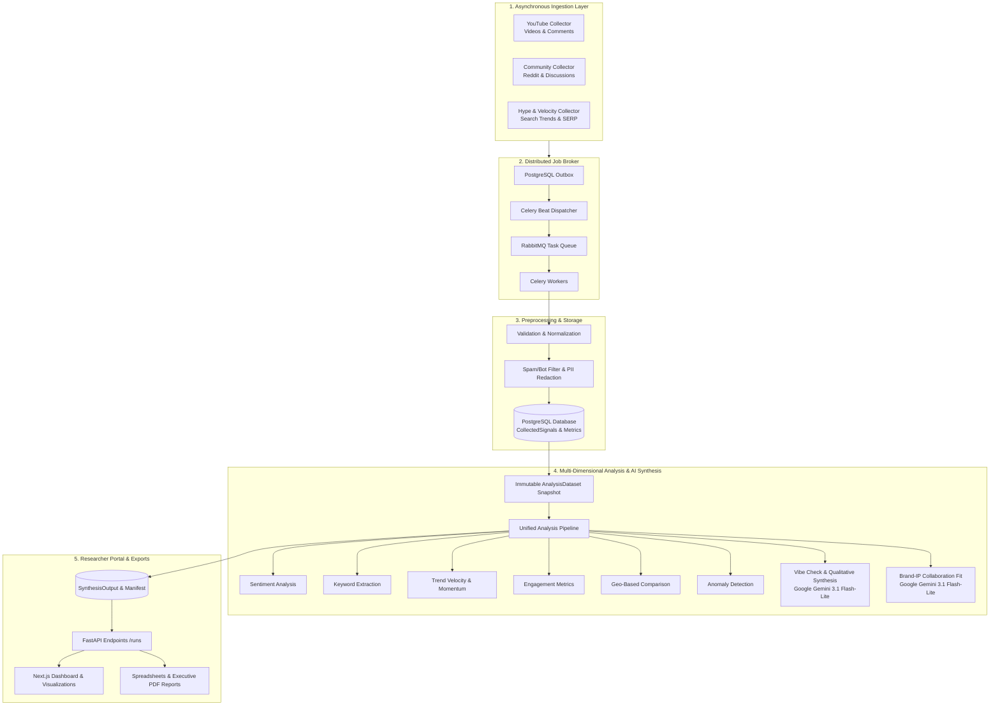

# Project Luvcraft Documentation Index & Functional Reference

Welcome to the technical documentation repository for **Project Luvcraft**, an AI-powered fandom intelligence and strategic collaboration platform developed in partnership with **Project Pluto**.

---

## 1. System Architecture & End-to-End Flow

---

## 2. Documentation Directory & Specification Catalog

Below is the complete guide to all technical specifications and architecture documents in `docs/`:

### Core Architecture & Execution Pipeline
* **[`docs/analysis-architecture.md`](analysis-architecture.md):** Defines how raw signal records are sealed into immutable dataset revisions (`AnalysisDataset`) and passed to analytical modules without inter-module order dependency.
* **[`docs/unified-analysis-pipeline.md`](unified-analysis-pipeline.md):** Describes the live finalization pipeline execution, transactional row locks (`with_for_update`), and projection into `SynthesisOutput`.
* **[`docs/analysis-output-schema.md`](analysis-output-schema.md):** Formal Pydantic contracts and JSON schema definitions for all analytical outputs.
* **[`docs/schema.md`](schema.md):** PostgreSQL entity relationship diagram (ERD), tables, foreign keys, and indexes.

### Artificial Intelligence & Synthesis Framework
* **[`docs/vibe-check-framework.md`](vibe-check-framework.md):** Architectural specification for the qualitative Vibe Check generative AI framework, scoring methodology, and provider fallbacks.
* **[`docs/hybrid-sentiment.md`](hybrid-sentiment.md):** Details the hybrid AI sentiment scoring architecture using Google Gemini 3.1 Flash-Lite with structured outputs, durable caching, and deterministic lexicon fallback.
* **[`docs/sentiment-analysis.md`](sentiment-analysis.md):** Deep dive into sentiment scoring logic, multilingual tokenization (English & Vietnamese), and distribution statistics.
* **[`docs/engagement-analysis.md`](engagement-analysis.md):** Mathematical formulas and normalization logic for interaction rates, engagement velocity, and signal weights.

### Collectors & Data Engineering
* **[`docs/collector.md`](collector.md):** Setup, authentication, rate limiting, and execution instructions for YouTube, Community, and Hype collectors.
* **[`docs/serpapi-collector.md`](serpapi-collector.md):** SerpApi Google Trends and public social SERP ingestion, quotas, and data semantics.
* **[`docs/rss-collector.md`](rss-collector.md):** Public RSS/Atom publication ingestion, configuration, and failure-isolation behaviour.

### Security, Roles & Authentication
* **[`docs/rbac.md`](rbac.md):** Multi-tenant Role-Based Access Control (RBAC) specification covering `admin`, `analyst`, `client`, and `viewer` permissions and tenant boundaries (`target_brand_id`).
* **[`docs/sso-frontend-integration.md`](sso-frontend-integration.md):** Supabase Auth, HTTPOnly session cookies, and Single Sign-On (SSO) integration details.

### Frontend Integration & Verification
* **[`docs/frontend-integration-plan-9.3-9.6.md`](frontend-integration-plan-9.3-9.6.md):** Frontend integration plan for dashboard state machines, live API bindings, and polling mechanisms.
* **[`docs/frontend-implementation-9.7-9.10.md`](frontend-implementation-9.7-9.10.md):** Architectural guide for advanced insight visualization sections (Geo-Comparison, Anomaly badges, Brand Collaboration).
* **[`docs/e2e-frontend-integration-test-report.md`](e2e-frontend-integration-test-report.md):** Verification report and quality gate audit for the 9-scenario End-to-End Frontend Integration Test Suite.

---

## 3. Function & Module Reference

| Component / File | Primary Function / Responsibility |
|---|---|
| `backend/app/tasks/analyze.py` | Celery task orchestrator; manages collector lifecycles and triggers pipeline finalization. |
| `backend/app/collectors/youtube.py` | Fetches YouTube video metadata, descriptions, view counts, likes, and comment threads. |
| `backend/app/collectors/community.py` | Gathers community discussions, Reddit posts/comments, and industry publication feeds. |
| `backend/app/collectors/compliance.py` | PII redaction (emails, phone numbers, handles) and spam/bot content filtering. |
| `backend/app/analysis/production.py` | Executes the sequential analytical stages over immutable `AnalysisDataset` snapshots. |
| `backend/app/analysis/modules/sentiment.py` | Computes aggregate positive/neutral/negative sentiment ratios and average scores. |
| `backend/app/analysis/modules/keywords.py` | Extracts top trending keywords, n-grams, and topic prevalence. |
| `backend/app/analysis/modules/trend.py` | Analyzes 30-day time-series momentum, velocity slopes, and acceleration. |
| `backend/app/analysis/modules/engagement.py` | Measures total views, likes, comments, interaction rates, and engagement per signal. |
| `backend/app/analysis/vibe_check/providers.py` | Google Gemini 3.1 Flash-Lite AI provider for qualitative Vibe Check synthesis (`GeminiVibeCheckProvider`). |
| `backend/app/analysis/vibe_check/collab_fit.py` | Google Gemini 3.1 Flash-Lite AI provider for Brand-IP Collaboration Fit evaluation (`GeminiCollabFitProvider`). |
| `backend/app/analysis/vibe_check/geo.py` | Calculates regional collector distributions, country rankings, and localized sentiment divergence. |
| `backend/app/analysis/vibe_check/anomaly.py` | Detects sudden volume spikes and engagement anomalies using statistical standard deviation bounds. |
| `backend/app/services/authorization_service.py` | Enforces server-authoritative role permissions and multi-tenant brand scoping. |
| `frontend/state/dashboard/dashboardContext.tsx` | Central React reducer and state machine managing research run lifecycles and polling. |
| `frontend/services/dashboard/resultAdapter.ts` | Type adapter converting raw backend synthesis payloads into clean UI visualization models. |
