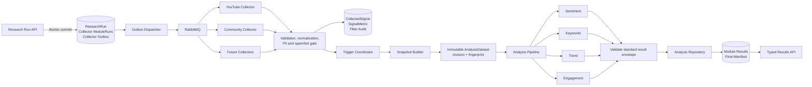
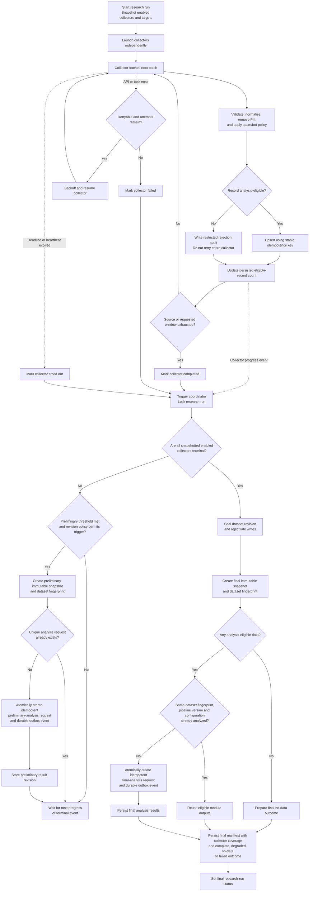

# Analysis Layer Architecture

## Purpose and scope

This document defines how Project Luvcraft converts eligible collector records
into versioned analytical results. It covers the analysis workflow, module
responsibilities, shared interfaces, processing order, and the preliminary/final
trigger design. Dashboard implementation is outside this scope.

The architecture has two distinct layers:

1. **Collection orchestration** fetches, validates, filters, and persists
   evidence.
2. **Analysis orchestration** seals one immutable dataset revision and gives that
   same revision to independent analytical modules.

The Python contracts, module registry, pipeline runner, and sentiment, keyword,
trend, and engagement modules are implemented in `backend/app/analysis`. The
collector finalizer now executes the complete registry over one final in-memory
snapshot, persists the validated execution and its exact result envelopes, and
projects the same canonical manifest into `SynthesisOutput`. The durable
snapshot/trigger coordinator shown below remains the target for preliminary
analysis and an analysis-specific transactional outbox.

## Component architecture



Every module receives the same `AnalysisDataset` snapshot identity. A module
selects only the fields it understands and does not consume another analysis
module's result. This prevents sentiment, keyword, trend, and engagement modules
from becoming order-dependent.

## Existing-to-target mapping

| Architecture concept | Current repository model/status |
|---|---|
| Research run | `ResearchRun` |
| Collector execution | `ModuleRun` (currently collector-oriented) |
| Common evidence | `CollectedSignal` |
| Time-series/engagement values | `SignalMetric` |
| Filtering evidence | `FilterAudit` and `FilterSummary` |
| Existing signal sentiment storage | `SentimentResult` |
| Existing run sentiment storage | `RunSentimentAggregate` |
| Legacy untyped API result | `SynthesisOutput.content` |
| Immutable analysis contract | Implemented as `AnalysisDataset` |
| Module interface and registry | Implemented |
| Storage-independent pipeline runner | Implemented |
| Lexicon and hybrid sentiment modules | Implemented |
| Keyword, trend, and engagement modules | Implemented and registered |
| Durable LLM sentiment inference cache | Implemented; hashes/provenance only, no raw text |
| Live final-only unified invocation | Implemented through the collector finalizer |
| Compatibility persistence | `SynthesisOutput.content.analysis_pipeline` |
| Durable final request and manifest | `AnalysisPipelineExecutionRecord` |
| Reusable module computation | `AnalysisResultRecord` |
| Durable preliminary snapshots/analysis outbox | Not implemented; belongs to orchestration work |

`ModuleRun` must not be reused for analysis-module executions without a schema
change. The current run finalizer assumes each `ModuleRun` represents a
collector.

## Canonical input decision

Canonical input does **not** mean flattening every collector output into one
wide record with many unrelated nullable columns.

The parent object is `AnalysisDataset`. Its children are ordered
`AnalysisSignal` records with a shared envelope:

- stable signal ID;
- source and signal type;
- cleaned text and language when text exists;
- one or more analytical modalities such as text, engagement, or trend
  observation;
- UTC publication and collection timestamps;
- named metrics when a source provides them.

Collector-specific values remain typed at the collector/storage boundary and
are projected into immutable signal children and module-specific dataset views.
For example:

- community records contribute discussion text and engagement metrics;
- YouTube records contribute video/comment text, views, and publish dates;
- a search-trend collector contributes time-stamped observations;
- the trend analysis module calculates the project's `up`, `down`, or `flat`
  result from those observations.

Missing data remains absent or `null`; it is never converted to zero. This gives
all modules one standardized snapshot without erasing differences between
collector outputs. `text_signals()`, `engagement_signals()`, and
`trend_signals()` select applicable records without creating different snapshot
identities. A metric-only trend record therefore does not lower sentiment
coverage.

## Module contract

All modules implement the storage-independent interface:

```python
class AnalysisModule(Protocol):
    name: ClassVar[str]
    version: ClassVar[str]
    input_modalities: ClassVar[tuple[SignalModality, ...]]

    def analyze(self, dataset: AnalysisDataset) -> AnalysisResult:
        ...
```

A module must:

- identify all behavior-changing configuration and provider/prompt versions;
- cache non-deterministic external inference using a stable input identity;
- return the standard result envelope;
- preserve the run, snapshot, stage, revision, and fingerprint identity;
- declare the text, engagement, trend, or other signal views it consumes;
- handle no applicable input without crashing;
- expose a module version whenever behavior changes.

A module must not:

- call collectors;
- contain direct database/provider implementation details; those belong behind
  injected cache and inference adapters;
- mutate the dataset;
- depend on another analytical module's output.

The explicit `AnalysisModuleRegistry` supports future modules without changing
the runner. `AnalysisPipeline` executes registered modules in stable order,
checks result identity, converts a module exception into a standardized failed
result, and continues with later modules.

## Processing sequence

1. At run creation, snapshot the enabled collectors, their valid-record
   targets, timeframe, and relevant configuration.
2. Run collectors independently.
3. Validate and normalize source output into `CollectedSignal` and
   `SignalMetric` records.
4. Exclude PII, spam, bot, duplicate, invalid, and out-of-window evidence from
   analytical input, while retaining restricted audit counts.
5. Emit collector progress or terminal events to the trigger coordinator.
6. Under a run-level lock, evaluate final eligibility before preliminary
   eligibility.
7. Seal an immutable, deterministically ordered dataset revision and calculate
   its SHA-256 fingerprint.
8. Dispatch an idempotent analysis request through a durable outbox.
9. Give the same dataset revision to every registered analysis module.
10. Validate and persist each standardized module result independently.
11. Persist a final manifest containing collector coverage, failures, module
    outcomes, and the final run outcome.
12. Expose typed results through the API.

## Trigger coordinator target design



Coordinator rules:

- The preliminary threshold is
  `ceil(configured_valid_record_target * 0.5)` for at least one enabled
  collector.
- Final evaluation has priority while the coordinator holds the run lock.
- `preliminary` and `final` are analysis stages, not quality statuses.
- Final analysis begins after all snapshotted enabled collectors are terminal,
  including failed, skipped, cancelled, and timed-out collectors.
- A final no-data manifest is stored even if there is no eligible evidence.
- Matching fingerprints may reuse module computation, but the system still
  records a distinct final manifest.
- A research run completes only after its final manifest is stored.

## Idempotency and storage boundaries

Two identities are required:

```text
Analysis request:
(run_id, analysis_stage, snapshot_revision)

Module computation:
(run_id, module, module_version, input_fingerprint)
```

The final-only production path enforces both identities with database unique
constraints. Each execution row stores its exact ordered result envelopes;
`analysis_results` separately keeps the best reusable computation for each
module/fingerprint key. A matching fingerprint can therefore reuse or upgrade
the computation cache without rewriting historical execution output.

The collector finalizer writes the execution, compatibility synthesis, and
research-run completion in one caller-managed transaction. A critical
assembly, projection, or persistence error propagates to task retry handling,
and terminal task redelivery resumes finalization without recollecting.

Durable preliminary snapshots and an analysis-specific transactional outbox
remain future orchestration work.

## Current production integration

The analysis implementation provides:

- immutable, validated Python contracts;
- stable module registration and pipeline execution;
- standardized success, degraded-coverage, no-data, and failure semantics;
- deterministic English/Vietnamese lexicon sentiment plus a structured,
  cache-backed LLM hybrid;
- deterministic keyword extraction, trend analysis, and engagement
  calculation, aggregation, and ranking;
- a compatibility adapter that builds one final `AnalysisDataset` after
  collector completion;
- live sequential execution in the stable
  `sentiment -> keywords -> trend -> engagement` order;
- structured pipeline and module lifecycle logging;
- validated final execution manifests and exact module envelopes persisted in
  `analysis_pipeline_executions`;
- reusable validated module computations persisted in `analysis_results`;
- the canonical durable manifest projected under
  `SynthesisOutput.content.analysis_pipeline`; and
- focused module, runner, production-assembly, worker, and live database tests.

This final-only compatibility integration does not claim that the target
preliminary/final coordinator is live. Durable preliminary snapshot scheduling
and an analysis outbox still require the orchestration work described above.
See `unified-analysis-pipeline.md` for the live execution and failure semantics.
