# YouTube, Community & Serpex Collector Documentation

This document describes how the YouTube, Community, and Serpex collectors work,
how to set them up, and how to use them within the **Project Luvcraft**
platform. The Serpex-specific data contract and capability boundary are
documented in [serpex-collector.md](serpex-collector.md).

---

## 1. Setup Instructions

The YouTube Collector relies on the official Google YouTube Data API v3 to fetch metadata for search terms. Follow these steps to configure and run it:

### Obtain a YouTube API Key
1. Go to the [Google Cloud Console](https://console.cloud.google.com/).
2. Create a new project or select an existing one.
3. Search for the **YouTube Data API v3** in the API Library and enable it.
4. Go to **Credentials**, click **Create Credentials**, and select **API Key**. Copy the key.

### Configure Environment Variables
You must set the following environment variables in your local `.env.local` file (copied from `.env.local.example`):

| Variable | Required | Default | Description |
| :--- | :--- | :--- | :--- |
| `YOUTUBE_API_KEY` | Yes | *None* | Your YouTube Data API v3 key. |
| `YOUTUBE_REGION_CODE` | No | `VN` | Region filter for searches (ISO 3166-1 alpha-2). |
| `YOUTUBE_RELEVANCE_LANGUAGE` | No | `vi` | Relevance language filter for searches. |
| `YOUTUBE_MAX_RESULTS` | No | `50` | Maximum number of videos to fetch per query (capped at 50 by API limitations). |
| `YOUTUBE_MIN_RECORDS_THRESHOLD` | No | `20` | Minimum signals required to complete without an `INSUFFICIENT_DATA` warning. |
| `YOUTUBE_TIMEOUT_MAX_RETRIES` | No | `3` | Maximum Celery worker retry attempts for transient timeout errors. |
| `YOUTUBE_TIMEOUT_RETRY_DELAY_SECONDS` | No | `60` | Delay in seconds between retries. |
| `GITHUB_TOKEN` | No | *None* | GitHub Personal Access Token to avoid search API rate limits. |
| `SERPEX_API_KEY` | Yes | *None* | Serpex.dev key for live public search-result collection. |
| `SERPEX_MAX_RESULTS` | No | `10` | Maximum records retained from the response; applied locally. |
| `SERPEX_TIMEOUT_SECONDS` | No | `10` | Timeout for one Serpex request. |
| `SERPEX_MAX_RETRIES` | No | `3` | Retry budget for rate limits and temporary failures. |
| `SERPEX_RETRY_DELAY_SECONDS` | No | `60` | Default retry delay when Serpex supplies no delay. |

### Running the Collector via the API

1. Start the Docker Compose stack (ensure your API key is in the local `.env.local`):
   ```bash
   docker compose --env-file .env.local up --build
   ```
2. Submit a research keyword to trigger the collection:
   ```bash
   curl -X POST http://localhost:8000/api/v1/runs \
     -H "Content-Type: application/json" \
     -d '{"keyword": "gaming community", "time_range_days": 7}'
   ```
   *(This responds with a JSON payload containing the generated `run_id`)*.
3. Poll the run status:
   ```bash
   curl http://localhost:8000/api/v1/runs/YOUR_RUN_ID
   ```
4. Query the normalized raw signals once status becomes `"completed"`:
   ```bash
   curl http://localhost:8000/api/v1/runs/YOUR_RUN_ID/signals
   ```

---

## 2. Collector Workflow

The collection and processing pipeline is fully asynchronous and leverages FastAPI, Celery, RabbitMQ, and PostgreSQL.

### High-Level Flow Diagram

```mermaid
sequenceDiagram
    participant User as Researcher Portal
    participant API as FastAPI Router (/runs)
    participant DB as PostgreSQL Database
    participant Dispatcher as Outbox Dispatcher
    participant Queue as RabbitMQ Queue
    participant YT_Worker as Celery Worker (YouTube)
    participant Comm_Worker as Celery Worker (Community)
    participant YT as YouTube API v3
    participant GH as GitHub API (Issues/PRs)

    User->>API: POST /api/v1/runs {keyword, time_range_days}
    API->>DB: Atomically create ResearchRun, ModuleRuns, and outbox events
    API->>Queue: Best-effort dispatcher nudge
    API-->>User: HTTP 202 Accepted (run_id)
    Dispatcher->>DB: Claim pending outbox events (FOR UPDATE SKIP LOCKED)
    Dispatcher->>Queue: Publish each collector task with stable task_id
    Note over Dispatcher,DB: Failed publications remain pending; Celery Beat retries

    par YouTube Task
        YT_Worker->>Queue: Poll & Dequeue YT job
        YT_Worker->>DB: Set YT ModuleRun to running
        YT_Worker->>YT: GET /search & /videos
        YT-->>YT_Worker: Return Video Details
        Note over YT_Worker: Clean, filter spam, run sentiment/aspects
        YT_Worker->>DB: Persist YT signals, metrics, aggregate
        YT_Worker->>DB: Set YT ModuleRun to completed
        YT_Worker->>DB: Run finalizer (_check_and_finalize_research_run)
    and Community Task
        Comm_Worker->>Queue: Poll & Dequeue Community job
        Comm_Worker->>DB: Set Community ModuleRun to running
        Comm_Worker->>GH: GET /search/issues
        GH-->>Comm_Worker: Return Issue Details
        Note over Comm_Worker: Clean, filter spam, run sentiment/aspects
        Comm_Worker->>DB: Persist Community signals, metrics, aggregate
        Comm_Worker->>DB: Set Community ModuleRun to completed
        Comm_Worker->>DB: Run finalizer (_check_and_finalize_research_run)
    end

    Note over DB: Whichever task finishes last merges all sentiments, aspects, dates and writes a single SynthesisOutput, marking ResearchRun completed
```

### Step-by-Step Architecture

1. **Submission (`API`)**:
   - The user submits a research keyword and timeframe via `POST /api/v1/runs`.
   - The API commits the `ResearchRun`, enabled `ModuleRun` rows, and one durable outbox event per module in a single database transaction.
   - A best-effort dispatcher nudge reduces latency. Celery Beat polls every five seconds, so a broker outage cannot lose the committed collection request.
   - Dispatch uses row locking and stable task IDs. Successfully published events are marked `published`; failed events remain `pending` with exponential retry backoff.

2. **YouTube Collection (`execute_youtube_collection_job`)**:
   - The YouTube Celery worker queries the `/search` endpoint to find videos matching the keyword and published within the timeframe, then retrieves video details and engagement statistics via the `/videos` endpoint.
   - Videos are normalized into standardized `CollectorRecord` instances.
   - Text fields (title and description) are validated and cleaned. Spam check filters out junk videos.
   - Non-spam records are persisted to `collected_signals` and `signal_metrics`.
   - Local sentiment/aspect extraction is run, and the results are persisted.
   - A module-level `RunSentimentAggregate` is written.

3. **Community Collection (`execute_community_collection_job`)**:
   - The Community Celery worker queries the GitHub search issues endpoint `/search/issues` with the keyword and timeframe query.
   - Issues are normalized into standardized `CollectorRecord` instances.
   - Title and body content are cleaned and validated.
   - Unique records are persisted to `collected_signals` and `signal_metrics`.
   - Local sentiment/aspect extraction is run, and the results are persisted.
   - A module-level `RunSentimentAggregate` is written.

4. **Serpex Collection (`execute_hype_collection_job`)**:
   - The worker sends the keyword to Serpex using an authenticated JSON
     `POST /api/search` request.
   - Public result titles and snippets are normalized as `serp_result`
     signals.
   - The response timestamp is stored as observation time, while the
     unavailable publication date remains null.
   - No views, likes, comments, search volume, or historical trend values are
     inferred from the response.

5. **Task Finalization & Synthesis (`_check_and_finalize_research_run`)**:
   - When each collector finishes (whether successful or failed), it updates its `ModuleRun` status and calls `_check_and_finalize_research_run`.
   - The finalizer checks if all enqueued module runs for this `ResearchRun` are finished.
   - If they are, it aggregates all collected signals for this run across all active platforms, computes the legacy summary, and builds one immutable final analysis dataset from non-spam signals.
   - It sequentially executes sentiment, keyword, trend, and engagement analysis with structured lifecycle logging and per-module failure isolation.
   - It writes the validated pipeline manifest under `SynthesisOutput.content.analysis_pipeline`, preserves the existing top-level dashboard fields, and sets `ResearchRun.status` to `"completed"`.

---

## 3. Database Schema

The collector stores normalized source records as `CollectedSignal` rows, keeps platform-specific metadata in JSONB fields, records engagement values as typed metrics, and links downstream analysis outputs back to the originating run and signal.

The standalone schema design document is available in [schema.md](schema.md).

```mermaid
erDiagram
    DATA_SOURCES ||--o{ SOURCE_CONFIGS : configures
    DATA_SOURCES ||--o{ COLLECTED_SIGNALS : provides
    DATA_SOURCES ||--o{ RUN_SENTIMENT_AGGREGATES : groups
    DATA_SOURCES ||--o{ FILTER_AUDITS : identifies_source

    RESEARCH_RUNS ||--o{ MODULE_RUNS : contains
    RESEARCH_RUNS ||--o{ SENTIMENT_RESULTS : produces
    RESEARCH_RUNS ||--o{ ASPECT_SENTIMENTS : produces
    RESEARCH_RUNS ||--o{ RUN_SENTIMENT_AGGREGATES : summarizes
    RESEARCH_RUNS ||--o{ SYNTHESIS_OUTPUTS : generates
    RESEARCH_RUNS ||--o{ FILTER_SUMMARIES : records
    RESEARCH_RUNS ||--o{ EXTRACTED_THEMES : extracts
    RESEARCH_RUNS ||--o{ GEO_INSIGHTS : generates
    RESEARCH_RUNS ||--o{ ANOMALY_EVENTS : detects
    RESEARCH_RUNS ||--o{ GENERATED_REPORTS : exports

    MODULE_RUNS ||--o{ COLLECTED_SIGNALS : collects

    COLLECTED_SIGNALS ||--o{ SIGNAL_METRICS : has
    COLLECTED_SIGNALS ||--o{ SENTIMENT_RESULTS : analyzed_as
    COLLECTED_SIGNALS ||--o{ ASPECT_SENTIMENTS : tagged_with
    COLLECTED_SIGNALS ||--o{ FILTER_AUDITS : reviewed_by

    DATA_SOURCES {
        UUID source_id PK
        string source_name
        string platform
        string source_category
        string access_method
        string base_url
        jsonb rate_limit_config
    }

    SOURCE_CONFIGS {
        UUID config_id PK
        UUID source_id FK
        string config_key
        string config_value
        jsonb scope_params
        boolean is_active
    }

    RESEARCH_RUNS {
        UUID run_id PK
        UUID target_brand_id FK
        string keyword
        date timeframe_start
        date timeframe_end
        string status
        jsonb filter_rules
        UUID created_by
        timestamptz completed_at
        timestamptz created_at
        timestamptz updated_at
    }

    MODULE_RUNS {
        UUID module_run_id PK
        UUID run_id FK
        string module_type
        string status
        int retry_count
        text error_detail
        timestamptz started_at
        timestamptz finished_at
    }

    COLLECTED_SIGNALS {
        UUID signal_id PK
        UUID module_run_id FK
        UUID source_id FK
        string external_item_id
        string content_hash
        string signal_type
        text raw_text
        text cleaned_text
        string language
        timestamptz published_at
        string country_code
        string location_mode
        jsonb platform_metadata
        boolean spam_flag
        timestamptz created_at
    }

    SIGNAL_METRICS {
        UUID metric_id PK
        UUID signal_id FK
        string metric_type
        numeric metric_value
        timestamptz recorded_at
    }

    SENTIMENT_RESULTS {
        UUID sentiment_id PK
        UUID signal_id FK
        UUID run_id FK
        string layer_source
        string sentiment_label
        numeric sentiment_score
        numeric confidence
        timestamptz processed_at
    }

    ASPECT_SENTIMENTS {
        UUID aspect_id PK
        UUID signal_id FK
        UUID run_id FK
        string aspect_name
        string sentiment_label
        numeric sentiment_score
        string extraction_method
        timestamptz processed_at
    }

    RUN_SENTIMENT_AGGREGATES {
        UUID aggregate_id PK
        UUID run_id FK
        UUID source_id FK
        string country_code
        numeric weighted_score
        numeric positive_pct
        numeric neutral_pct
        numeric negative_pct
        int signal_count
        numeric avg_confidence
        jsonb top_aspects
        timestamptz computed_at
    }

    SYNTHESIS_OUTPUTS {
        UUID synthesis_id PK
        UUID run_id FK
        string output_type
        jsonb content
        string model_used
        string prompt_version
        numeric confidence_score
        timestamptz generated_at
    }

    FILTER_AUDITS {
        UUID audit_id PK
        UUID signal_id FK
        UUID source_from_id FK
        boolean retained_flag
        string exclusion_reason
        numeric confidence_score
        timestamptz processed_at
    }

    FILTER_SUMMARIES {
        UUID summary_id PK
        UUID run_id FK
        int total_checked_count
        int retained_count
        int spam_count
        int bot_count
        int duplicate_count
        int low_quality_count
        numeric exclusion_rate
        timestamptz processed_at
    }

    EXTRACTED_THEMES {
        UUID theme_id PK
        UUID run_id FK
        string theme_label
        string theme_category
        int mention_count
        numeric growth_rate
        int prevalence_rank
        jsonb representative_signals
        timestamptz generated_at
    }

    GEO_INSIGHTS {
        UUID geo_id PK
        UUID run_id FK
        string country_code
        string country_name
        int signal_count
        numeric sentiment_score_avg
        numeric sentiment_vs_global
        numeric trend_velocity
        jsonb top_themes
        string location_confidence
        timestamptz generated_at
    }

    ANOMALY_EVENTS {
        UUID anomaly_id PK
        UUID run_id FK
        string anomaly_type
        string metric_name
        numeric observed_value
        numeric baseline_value
        numeric deviation_score
        string severity
        text probable_cause
        timestamptz detected_at
        jsonb evidence_signals
    }

    GENERATED_REPORTS {
        UUID report_id PK
        UUID run_id FK
        string report_type
        string file_path
        int file_size_bytes
        timestamptz generated_at
    }
```



Key design points:

- Multiple sources are represented by `data_sources`, with source-specific settings in `source_configs`.
- Collected content is normalized into `collected_signals`; raw source payload details stay extensible through `platform_metadata`.
- Engagement values such as views, likes, and comments are stored as `signal_metrics` rows keyed by `metric_type`.
- Result tables keep both run-level outputs and signal-level outputs linked through foreign keys.

---

## 4. Code Usage

### 1. Programmatic Usage (Python)

To run either collector manually in a Python script (e.g., `scratch_collect.py` placed at the repository root):

```python
from datetime import datetime, timedelta, timezone
from app.collectors.youtube import YouTubeCollector
from app.collectors.community import CommunityCollector

# --- 1. YouTube Collector ---
yt_collector = YouTubeCollector(
    api_key="YOUR_YOUTUBE_API_KEY",
    region_code="VN",
    relevance_language="vi"
)

published_after = datetime.now(timezone.utc) - timedelta(days=7)
published_before = datetime.now(timezone.utc)

yt_records = yt_collector.collect(
    keyword="gaming community",
    published_after=published_after,
    published_before=published_before,
    max_results=10
)

print(f"YouTube Records: {len(yt_records)}")

# --- 2. Community Collector ---
comm_collector = CommunityCollector(
    github_token="YOUR_GITHUB_TOKEN"
)

comm_records = comm_collector.collect(
    keyword="valorant",
    published_after=published_after,
    published_before=published_before,
    max_results=10
)

print(f"Community (GitHub) Records: {len(comm_records)}")
for record in comm_records[:3]:
    print(f"- Title: {record.title}")
    print(f"  Engagement: {record.engagement}")
```

To execute this script from the repository root, you must configure the `PYTHONPATH` to include the `backend/` folder:

**macOS / Linux (Bash):**
```bash
PYTHONPATH=backend backend/.venv/bin/python scratch_collect.py
```

**Windows (PowerShell):**
```powershell
$env:PYTHONPATH="backend"
backend\.venv\Scripts\python.exe scratch_collect.py
```

*(Alternatively, you can execute your script from within the `backend/` directory, in which case `PYTHONPATH` is resolved automatically by the interpreter)*.


### 2. Executing Integration Tests

To run the integration tests locally:

**macOS / Linux (Bash):**
```bash
# Ensure you are in the project root directory
PYTHONPATH=backend backend/.venv/bin/python -m pytest backend/app/tests/test_pipeline_integration.py
```

**Windows (PowerShell):**
```powershell
# Ensure you are in the project root directory
$env:PYTHONPATH="backend"
backend\.venv\Scripts\python.exe -m pytest backend/app/tests/test_pipeline_integration.py
```

*(Make sure a local PostgreSQL instance is running on `localhost:5432` with a database named `luvcraft_pipeline_test` or customize it via `PIPELINE_TEST_DATABASE_URL`)*.

---

## 5. Collector Framework

`YouTubeCollector`, `CommunityCollector`, and `SerpexSearchCollector` are
implementations of the shared collector framework in
`backend/app/collectors/collector_base.py`. Every collector is built the same
way:

- **Standard input** - `collect(keyword, published_after, published_before, max_results)` is the
  one entrypoint orchestration code calls, regardless of source. Keyword and
  time window are always passed at call time, never baked into the
  constructor, so a single `ResearchRun` can drive any collector uniformly.
- **Standard output** - every collector returns `list[CollectorRecord]`
  (`YouTubeRecord` is simply an alias for `CollectorRecord`). Persistence
  code only needs to understand this one shape.
- **Shared cross-cutting behavior** - `BaseCollector` applies the configured
  endpoint and a PostgreSQL token bucket shared by all worker processes and
  replicas, validates normalized records, and sanitizes PII before returning
  them. Persistence applies the same sanitizer again as a
  defense-in-depth boundary. `filter_spam_and_bots` remains an extension point;
  persistence performs the auditable spam classification used by analysis.
  The bucket capacity is one to preserve evenly spaced request pacing. A
  database failure denies the token, so no unthrottled external request is
  sent while coordination is unavailable.
  Content IDs remain available for idempotency, while account/channel IDs,
  human-readable handles, contact details, and raw API payloads are removed.
- **Standard error hierarchy** - `CollectorError` and its subclasses
  (`CollectorAuthError`, `CollectorQuotaError`, `CollectorTimeoutError`,
  `CollectorMalformedResponseError`) let orchestration code handle failures
  the same way across sources. Source-specific errors (e.g.
  `YouTubeQuotaError`) subclass both the generic and the source-specific
  base so callers can catch at either level.

### Adding a New Collector

1. Subclass `BaseCollector` in a new module under `backend/app/collectors/`, set
   its `registry_key`, and implement
   `_collect(self, *, keyword, published_after, published_before, max_results) -> list[CollectorRecord]`
   with your source's search/fetch/normalize logic (see `YouTubeCollector`,
   `CommunityCollector`, and `SerpexSearchCollector` for live HTTP-API
   examples; `SocialCollector` remains a disabled placeholder).
2. Use the inherited `self._get_json(path, params)` or
   `self._post_json(path, payload, headers=...)` for JSON APIs and override
   `_raise_for_api_error` only when the platform needs custom error
   classification. The configured primary endpoint and request rate are
   injected automatically.
3. Add a YAML stanza keyed by `registry_key`. Declare the collector's
   `collector_class` import path, endpoint(s), source metadata, strict
   `enabled` boolean, and positive `rate_limit_per_minute`. API and worker
   startup fail closed if the configuration is missing or invalid.
4. A production-enabled collector must also declare a Celery `task_name` that
   is registered by the worker and persists its normalized records. The API
   validates task registration before creating a run. Collectors without a
   production persistence task must remain disabled; adding YAML alone cannot
   invent source-specific collection or persistence behavior.
5. Add behavior tests alongside `app/tests/test_collector_base.py` and
   `app/tests/test_youtube_collector.py`.

Configured implementations need no decorator: `CollectorRegistry` imports the
validated `collector_class` path deterministically. `register()` and
`force_register_class()` are retained for isolated programmatic collectors and
explicit test overrides. Abstract classes and conflicting registrations are
rejected before instantiation.

> **Requirement gaps** – the following are known and tracked explicitly in
> `collector_base.py`:
> - `filter_spam_and_bots` is an extension point because downstream processing
>   retains spam/exclusion statistics. PII sanitization is mandatory and runs
>   centrally in `BaseCollector.enforce_compliance` and again before database
>   persistence.
> - `check_robots_txt` logs but always returns `True`; `urllib.robotparser`
>   integration is not yet implemented.
> - SLA violations are logged but do not abort a running collector.
