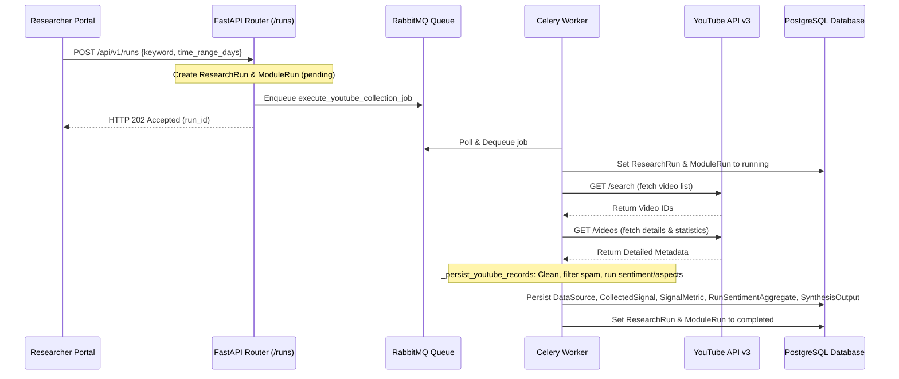

# YouTube Collector MVP Documentation

This document describes how the YouTube Collector MVP works, how to set it up, and how to use it within the **Project Luvcraft** platform.

---

## 1. Setup Instructions

The YouTube Collector relies on the official Google YouTube Data API v3 to fetch metadata for search terms. Follow these steps to configure and run it:

### Obtain a YouTube API Key
1. Go to the [Google Cloud Console](https://console.cloud.google.com/).
2. Create a new project or select an existing one.
3. Search for the **YouTube Data API v3** in the API Library and enable it.
4. Go to **Credentials**, click **Create Credentials**, and select **API Key**. Copy the key.

### Configure Environment Variables
You must set the following environment variables in your local `.env` file (copied from `.env.local.example`):

| Variable | Required | Default | Description |
| :--- | :--- | :--- | :--- |
| `YOUTUBE_API_KEY` | Yes | *None* | Your YouTube Data API v3 key. |
| `YOUTUBE_REGION_CODE` | No | `VN` | Region filter for searches (ISO 3166-1 alpha-2). |
| `YOUTUBE_RELEVANCE_LANGUAGE` | No | `vi` | Relevance language filter for searches. |
| `YOUTUBE_MAX_RESULTS` | No | `50` | Maximum number of videos to fetch per query (capped at 50 by API limitations). |
| `YOUTUBE_MIN_RECORDS_THRESHOLD` | No | `20` | Minimum signals required to complete without an `INSUFFICIENT_DATA` warning. |
| `YOUTUBE_TIMEOUT_MAX_RETRIES` | No | `3` | Maximum Celery worker retry attempts for transient timeout errors. |
| `YOUTUBE_TIMEOUT_RETRY_DELAY_SECONDS` | No | `60` | Delay in seconds between retries. |

### Running the Collector via the API

1. Start the Docker Compose stack (ensure your API key is in the local `.env`):
   ```bash
   docker compose up --build
   ```
2. Submit a research keyword to trigger the collection:
   ```bash
   curl -X POST http://localhost:8000/api/v1/runs \
     -H "Content-Type: application/json" \
     -d '{"keyword": "gaming community", "time_range_days": 7}'
   ```
   *(This responds with a JSON payload containing the generated `run_id`)*.
3. Poll the run status:
   ```bash
   curl http://localhost:8000/api/v1/runs/YOUR_RUN_ID
   ```
4. Query the normalized raw signals once status becomes `"completed"`:
   ```bash
   curl http://localhost:8000/api/v1/runs/YOUR_RUN_ID/signals
   ```

---

## 2. Collector Workflow

The collection and processing pipeline is fully asynchronous and leverages FastAPI, Celery, RabbitMQ, and PostgreSQL.

### High-Level Flow Diagram



### Step-by-Step Architecture

1. **Submission (`API`)**:
   - The user submits a research keyword and timeframe via `POST /api/v1/runs`.
   - The API creates a `ResearchRun` and a `ModuleRun` entry in the database (both set to `pending`).
   - The API enqueues `execute_youtube_collection_job` in Celery via RabbitMQ.

2. **Search (`YouTubeCollector.search_videos`)**:
   - The Celery worker picks up the job and instantiates the `YouTubeCollector`.
   - It queries the `/search` endpoint to find videos matching the keyword and published within the timeframe.

3. **Retrieval (`YouTubeCollector.fetch_video_details`)**:
   - The collector extracts video IDs and queries the `/videos` endpoint to get engagement metrics (`viewCount`, `likeCount`, `commentCount`) and snippets.

4. **Data Normalization (`YouTubeCollector.normalize`)**:
   - Metadata is mapped and cast directly into standard `YouTubeRecord` data structures.

5. **Enrichment & Persistence (`_persist_youtube_records` inside `backend/app/tasks/analyze.py`)**:
   - Text fields (title and description) are cleaned (`clean_text`) and checked for spam (`is_spam`).
   - Non-spam signals undergo local sentiment and aspect extraction.
   - Unique signals are saved as `CollectedSignal` rows.
   - Engagement statistics are saved in `SignalMetric` rows.
   - Aggregated metrics (positive/negative/neutral percentages, top aspects) are stored in `RunSentimentAggregate`.
   - A final `SynthesisOutput` summary is generated.

6. **Task Resolution**:
   - The status is updated to `completed` (or `failed` in case of critical exceptions like `YouTubeQuotaError`).

---

## 3. Code Usage

### 1. Programmatic Usage (Python)

To run the collector manually in a Python script (e.g., `scratch_collect.py` placed at the repository root):

```python
from datetime import datetime, timedelta, timezone
from app.collectors.youtube import YouTubeCollector

# Initialize the collector
collector = YouTubeCollector(
    api_key="YOUR_YOUTUBE_API_KEY",
    region_code="VN",
    relevance_language="vi"
)

# Define timeframe
published_after = datetime.now(timezone.utc) - timedelta(days=7)
published_before = datetime.now(timezone.utc)

# Collect and normalize records
records = collector.collect(
    keyword="gaming community",
    published_after=published_after,
    published_before=published_before,
    max_results=10
)

# Inspect results
for record in records:
    print(f"Title: {record.title}")
    print(f"Engagement: {record.engagement}")
```

To execute this script from the repository root, you must configure the `PYTHONPATH` to include the `backend/` folder:

**macOS / Linux (Bash):**
```bash
PYTHONPATH=backend backend/.venv/bin/python scratch_collect.py
```

**Windows (PowerShell):**
```powershell
$env:PYTHONPATH="backend"
backend\.venv\Scripts\python.exe scratch_collect.py
```

*(Alternatively, you can execute your script from within the `backend/` directory, in which case `PYTHONPATH` is resolved automatically by the interpreter)*.


### 2. Executing Integration Tests

To run the integration tests locally:

**macOS / Linux (Bash):**
```bash
# Ensure you are in the project root directory
PYTHONPATH=backend backend/.venv/bin/python -m pytest backend/app/tests/test_pipeline_integration.py
```

**Windows (PowerShell):**
```powershell
# Ensure you are in the project root directory
$env:PYTHONPATH="backend"
backend\.venv\Scripts\python.exe -m pytest backend/app/tests/test_pipeline_integration.py
```

*(Make sure a local PostgreSQL instance is running on `localhost:5432` with a database named `luvcraft_pipeline_test` or customize it via `PIPELINE_TEST_DATABASE_URL`)*.
