# Database Schema

This document describes the PostgreSQL schema used to store collected source data, source metadata, engagement metrics, and downstream analysis results across Project Luvcraft modules.

The schema is based on the SQLAlchemy models in `backend/app/models` and the Alembic migrations in `backend/alembic/versions`.

## Entity Relationship Diagram

```mermaid
erDiagram
    DATA_SOURCES ||--o{ SOURCE_CONFIGS : configures
    DATA_SOURCES ||--o{ COLLECTED_SIGNALS : provides
    DATA_SOURCES ||--o{ RUN_SENTIMENT_AGGREGATES : groups
    DATA_SOURCES ||--o{ FILTER_AUDITS : identifies_source

    RESEARCH_RUNS ||--o{ MODULE_RUNS : contains
    RESEARCH_RUNS ||--o{ SENTIMENT_RESULTS : produces
    RESEARCH_RUNS ||--o{ ASPECT_SENTIMENTS : produces
    RESEARCH_RUNS ||--o{ RUN_SENTIMENT_AGGREGATES : summarizes
    RESEARCH_RUNS ||--o{ SYNTHESIS_OUTPUTS : generates
    RESEARCH_RUNS ||--o{ FILTER_SUMMARIES : records
    RESEARCH_RUNS ||--o{ EXTRACTED_THEMES : extracts
    RESEARCH_RUNS ||--o{ GEO_INSIGHTS : generates
    RESEARCH_RUNS ||--o{ ANOMALY_EVENTS : detects
    RESEARCH_RUNS ||--o{ GENERATED_REPORTS : exports

    MODULE_RUNS ||--o{ COLLECTED_SIGNALS : collects

    COLLECTED_SIGNALS ||--o{ SIGNAL_METRICS : has
    COLLECTED_SIGNALS ||--o{ SENTIMENT_RESULTS : analyzed_as
    COLLECTED_SIGNALS ||--o{ ASPECT_SENTIMENTS : tagged_with
    COLLECTED_SIGNALS ||--o{ FILTER_AUDITS : reviewed_by

    DATA_SOURCES {
        UUID source_id PK
        string source_name
        string platform
        string source_category
        string access_method
        string base_url
        jsonb rate_limit_config
    }

    SOURCE_CONFIGS {
        UUID config_id PK
        UUID source_id FK
        string config_key
        string config_value
        jsonb scope_params
        boolean is_active
    }

    RESEARCH_RUNS {
        UUID run_id PK
        UUID target_brand_id FK
        string keyword
        date timeframe_start
        date timeframe_end
        string status
        jsonb filter_rules
        UUID created_by
        timestamptz completed_at
        timestamptz created_at
        timestamptz updated_at
    }

    MODULE_RUNS {
        UUID module_run_id PK
        UUID run_id FK
        string module_type
        string status
        int retry_count
        text error_detail
        timestamptz started_at
        timestamptz finished_at
    }

    COLLECTED_SIGNALS {
        UUID signal_id PK
        UUID module_run_id FK
        UUID source_id FK
        string external_item_id
        string content_hash
        string signal_type
        text raw_text
        text cleaned_text
        string language
        timestamptz published_at
        string country_code
        string location_mode
        jsonb platform_metadata
        boolean spam_flag
        timestamptz created_at
    }

    SIGNAL_METRICS {
        UUID metric_id PK
        UUID signal_id FK
        string metric_type
        numeric metric_value
        timestamptz recorded_at
    }

    SENTIMENT_RESULTS {
        UUID sentiment_id PK
        UUID signal_id FK
        UUID run_id FK
        string layer_source
        string sentiment_label
        numeric sentiment_score
        numeric confidence
        timestamptz processed_at
    }

    ASPECT_SENTIMENTS {
        UUID aspect_id PK
        UUID signal_id FK
        UUID run_id FK
        string aspect_name
        string sentiment_label
        numeric sentiment_score
        string extraction_method
        timestamptz processed_at
    }

    RUN_SENTIMENT_AGGREGATES {
        UUID aggregate_id PK
        UUID run_id FK
        UUID source_id FK
        string country_code
        numeric weighted_score
        numeric positive_pct
        numeric neutral_pct
        numeric negative_pct
        int signal_count
        numeric avg_confidence
        jsonb top_aspects
        timestamptz computed_at
    }

    SYNTHESIS_OUTPUTS {
        UUID synthesis_id PK
        UUID run_id FK
        string output_type
        jsonb content
        string model_used
        string prompt_version
        numeric confidence_score
        timestamptz generated_at
    }

    FILTER_AUDITS {
        UUID audit_id PK
        UUID signal_id FK
        UUID source_from_id FK
        boolean retained_flag
        string exclusion_reason
        numeric confidence_score
        timestamptz processed_at
    }

    FILTER_SUMMARIES {
        UUID summary_id PK
        UUID run_id FK
        int total_checked_count
        int retained_count
        int spam_count
        int bot_count
        int duplicate_count
        int low_quality_count
        numeric exclusion_rate
        timestamptz processed_at
    }

    EXTRACTED_THEMES {
        UUID theme_id PK
        UUID run_id FK
        string theme_label
        string theme_category
        int mention_count
        numeric growth_rate
        int prevalence_rank
        jsonb representative_signals
        timestamptz generated_at
    }

    GEO_INSIGHTS {
        UUID geo_id PK
        UUID run_id FK
        string country_code
        string country_name
        int signal_count
        numeric sentiment_score_avg
        numeric sentiment_vs_global
        numeric trend_velocity
        jsonb top_themes
        string location_confidence
        timestamptz generated_at
    }

    ANOMALY_EVENTS {
        UUID anomaly_id PK
        UUID run_id FK
        string anomaly_type
        string metric_name
        numeric observed_value
        numeric baseline_value
        numeric deviation_score
        string severity
        text probable_cause
        timestamptz detected_at
        jsonb evidence_signals
    }

    GENERATED_REPORTS {
        UUID report_id PK
        UUID run_id FK
        string report_type
        string file_path
        int file_size_bytes
        timestamptz generated_at
    }
```

## Design Notes

- Multiple sources are represented by `data_sources`, with source-specific settings in `source_configs`.
- Collected content is normalized into `collected_signals`; raw source payload details stay extensible through `platform_metadata`.
- Engagement values such as views, likes, and comments are stored as `signal_metrics` rows keyed by `metric_type`.
- Results are split between signal-level outputs, such as `sentiment_results` and `aspect_sentiments`, and run-level outputs, such as `run_sentiment_aggregates` and `synthesis_outputs`.
- Future modules can attach records through `module_runs.module_type`, `collected_signals.signal_type`, and JSONB fields for source-specific metadata, configuration, and output payloads.

## Acceptance Coverage

| Requirement | Schema support |
| :--- | :--- |
| Multiple data sources | `data_sources`, `source_configs`, and `source_id` foreign keys |
| Content | `collected_signals.raw_text`, `collected_signals.cleaned_text` |
| Source | `data_sources.platform`, `data_sources.source_name`, `collected_signals.source_id` |
| Timestamp | `published_at`, `created_at`, `recorded_at`, `processed_at`, `computed_at`, `generated_at` |
| Engagement metrics | `signal_metrics.metric_type`, `signal_metrics.metric_value` |
| Relationships | Foreign keys between runs, modules, sources, signals, metrics, and result tables |
| Extensibility | `module_type`, `signal_type`, `platform_metadata`, `scope_params`, and JSONB result fields |
