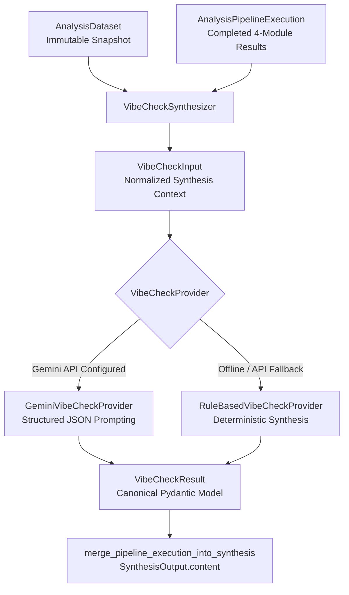

# Vibe Check Qualitative Synthesis Framework Architecture

## Purpose & Overview

The **Vibe Check Framework** serves as the qualitative generative AI synthesis layer in Project Luvcraft. While the 4 quantitative analytical modules (`sentiment`, `keywords`, `trend`, and `engagement`) compute versioned numeric scores, term frequencies, momentum directions, and interaction metrics, the Vibe Check Framework synthesizes these outputs together with raw signal text into human-readable narrative insights.

It produces:
- **Headline**: High-level executive summary title.
- **Overall Vibe**: Qualitative fandom/community posture label (e.g. *"Cautiously Optimistic (Lore Expansion Hype)"*).
- **Sentiment Narrative**: Explanatory narrative paragraph contextualizing sentiment scores and distributions.
- **Narrative Themes**: Core community topics with evidence counts and sentiment orientation.
- **Audience Posture**: Community breakdown (who is talking, toxicity level, consensus rating, and key requested demands).
- **Strategic Takeaways**: Actionable recommendation bullet points for researchers and brand strategists.

## Component Architecture



## Contracts & Schemas

### Input Contract: `VibeCheckInput`
Immutable input context constructed by `VibeCheckSynthesizer`:
- `run_id`: UUID
- `keyword`: Target search keyword.
- `timeframe_start` & `timeframe_end`: Analysis window.
- `sample_text_snippets`: Up to 15 representative signal text quotes.
- Quantitative Module Metrics:
  - `sentiment_score`, `sentiment_label`, `positive_count`, `neutral_count`, `negative_count`
  - `top_keywords`: Tuple of top extracted keywords.
  - `trend_score`, `trend_momentum` (`rising`, `stable`, `fading`)
  - `total_engagement_signals`, `total_views`, `total_likes`, `total_comments`

### Output Contract: `VibeCheckResult`
Canonical structured qualitative output:
- `headline`: High-level summary title string.
- `overall_vibe`: Qualitative vibe posture string.
- `confidence_score`: Float rating between 0.0 and 1.0.
- `sentiment_narrative`: Qualitative summary text.
- `narrative_themes`: Tuple of `VibeCheckNarrativeTheme` objects.
- `audience_posture`: `VibeCheckAudiencePosture` object.
- `strategic_takeaways`: Tuple of strategic recommendation strings.
- `provider_name` & `model_version`: Provenance tracking metadata.

## Provider Architecture

The framework utilizes a pluggable provider abstraction (`VibeCheckProvider` protocol):

1. **`GeminiVibeCheckProvider`**:
   - Uses Google Gemini API (`gemini-3.1-flash-lite`) with structured JSON output schemas (`response_schema=VibeCheckResult`).
   - System prompt instructions (`VIBE_CHECK_GEMINI_SYSTEM_PROMPT`) enforce untrusted text handling and JSON schema compliance.
   - Automatically catches network errors, schema validation issues, or missing API keys and falls back to `RuleBasedVibeCheckProvider`.

2. **`RuleBasedVibeCheckProvider`**:
   - High-performance, deterministic fallback provider.
   - Derives qualitative posture and themes directly from quantitative sentiment scores, keyword frequencies, and trend momentum without external API network calls.

## Production Integration & Backward Compatibility

`VibeCheckSynthesizer` integrates into `merge_pipeline_execution_into_synthesis` in `backend/app/analysis/production.py`:
- `content["vibe_check"]`: Stores the primary qualitative posture label for legacy API and frontend widget compatibility.
- `content["vibe_headline"]`: Stores the executive headline string.
- `content["vibe_sentiment_narrative"]`: Stores the qualitative sentiment narrative paragraph.
- `content["vibe_check_details"]`: Stores the complete `VibeCheckResult` JSON dict.

## Vibe Score (Task 8.2)

`VibeScoreCalculator` (`backend/app/analysis/vibe_check/scoring.py`) produces a single deterministic 0–100 **Vibe Score** per pipeline execution, methodology `vibe-score-v1`.

### Weighting strategy

| Component | Source | Normalization | Default weight |
|---|---|---|---|
| `sentiment` | `SentimentAnalysisData.average_score` | native 0–100 | 0.5 |
| `trend` | `TrendAnalysisData.trend_score` | native 0–100 | 0.3 |
| `engagement` | interactions per signal (views+likes+comments) | `min(100, 25 · log10(1 + x))` — documented heuristic | 0.2 |

Weights are configurable via `VibeScoreWeights` and must sum to 1.0.

### Missing-data policy

Absent or failed module results are **excluded** and remaining weights are renormalized — no fabricated `50` defaults. If no component is available the result is an explicit `insufficient_data` status with a null score. Identical inputs always produce identical scores.

### Labels

`>=80 very_positive`, `>=60 positive`, `>=40 neutral`, `>=20 negative`, else `very_negative`.

### Synthesis projection

`merge_pipeline_execution_into_synthesis` projects `vibe_score`, `vibe_score_label`, and the full `vibe_score_details` dict into `SynthesisOutput.content` for dashboard consumption.

## Community Health Assessment (Task 8.3)

`backend/app/analysis/vibe_check/community_health.py` classifies the overall
condition of a community from quantitative analytical indicators. It is
deterministic and rule-based: no LLM is involved, and identical inputs always
produce identical results. Methodology version: `community-health-v1`.

### Categories

Five ordered categories, best to worst:

| Category | Meaning |
|---|---|
| `thriving` | Indicators are consistently strong; the community is growing and positive. |
| `healthy` | Mostly strong indicators with some moderate signals. |
| `stable` | Indicators are broadly moderate; no growth signal, no distress signal. |
| `at_risk` | Several weak indicators; negativity or decline is visible. |
| `critical` | Indicators are consistently weak; the community is in distress. |

### Indicators

| Indicator | Source | Scale | Direction |
|---|---|---|---|
| `sentiment_score` | `sentiment.average_score` | 0-100 | higher is healthier |
| `negative_ratio` | `negative_count / (positive + neutral + negative)` from `sentiment.distribution` | 0-1 | lower is healthier |
| `trend_score` | `trend.trend_score` | 0-100 | higher is healthier |
| `engagement_coverage` | `engagement.summary.complete_signal_count / engagement.summary.signal_count` | 0-1 | higher is healthier |

`engagement_coverage` measures how many collected signals reported a complete
engagement profile — it is a proxy for how observable the community is, not for
how large it is.

### Configurable thresholds

`CommunityHealthThresholds` is a frozen, validated model. Each indicator has a
`*_strong` and `*_moderate` boundary. For higher-is-better indicators these are
inclusive lower bounds; for `negative_ratio` they are inclusive upper bounds.

| Field | Default |
|---|---|
| `sentiment_strong` / `sentiment_moderate` | 65.0 / 45.0 |
| `negative_ratio_strong` / `negative_ratio_moderate` | 0.15 / 0.35 |
| `trend_strong` / `trend_moderate` | 60.0 / 45.0 |
| `engagement_coverage_strong` / `engagement_coverage_moderate` | 0.6 / 0.3 |

Validation enforces monotonic ordering: `strong` must exceed `moderate` for
higher-is-better indicators, and must be below `moderate` for `negative_ratio`.
Out-of-range values are rejected by the field constraints. Pass a custom
instance to `CommunityHealthAssessor(thresholds=...)` to change classification
behaviour without touching code.

### Points system

Each available indicator is labelled and scored:

| Assessment | Points |
|---|---|
| `strong` | 2 |
| `moderate` | 1 |
| `weak` | 0 |

The classifier takes the **mean point value across available indicators only**
and maps it onto a category:

| Mean points (inclusive lower bound) | Category |
|---|---|
| >= 1.75 | `thriving` |
| >= 1.25 | `healthy` |
| >= 0.75 | `stable` |
| >= 0.25 | `at_risk` |
| >= 0.0 | `critical` |

### Missing-data policy

Values are never fabricated. When a module result is absent, failed, or does not
expose the underlying field, the indicator is emitted with `available=False`, a
null `value`, and a null `assessment`, and is excluded from the mean rather than
substituted with a default. Confidence degrades accordingly:

| Available indicators | Confidence |
|---|---|
| 3 or more | `high` |
| 2 | `moderate` |
| 1 | `low` |

When zero indicators are available the result is `status="insufficient_data"`
with a null `category`, null `confidence`, and null `score_points`. The
`rationale` string is composed deterministically from the indicator assessments
and explicitly lists which indicators were excluded.

### Production integration

`merge_pipeline_execution_into_synthesis` in `backend/app/analysis/production.py`
projects the assessment into synthesis content:
- `content["community_health"]`: the category string (or `None`).
- `content["community_health_confidence"]`: the confidence label.
- `content["community_health_details"]`: the complete `CommunityHealthResult`
  JSON dict, including every indicator and the echoed thresholds.

The projection is guarded by `try/except` with `logger.exception`, so an
assessment failure can never break synthesis assembly.

## Insight Summary (Task 8.4)

`backend/app/analysis/vibe_check/insights.py` composes the short, human-readable
conclusion of one research run from the numbers the other modules already
produced. It is deterministic and rule-based: no LLM is involved, and identical
inputs always produce an identical summary. Methodology version:
`insight-summary-v1`.

### Findings model

A summary is assembled from *findings*. Each finding is one clause plus the
concrete value it was derived from:

| Field | Meaning |
|---|---|
| `category` | One of `sentiment`, `trend`, `engagement`, `keywords`, `vibe_score`, `community_health`. |
| `statement` | One single-clause sentence, bounded at `MAX_STATEMENT_CHARACTERS` (96). |
| `evidence` | The originating field path(s) and observed value(s), e.g. `sentiment.average_score=72.4`. |
| `source_module` | The module that produced the evidence, e.g. `trend` or `vibe_check.scoring`. |

At most one finding per category is emitted, always in the fixed order above
(`INSIGHT_CATEGORY_ORDER`), so the summary text is stable across runs.

`InsightSummary` carries `status` (`generated` | `insufficient_data`), the
composed `summary` string, `key_findings`, `contributing_modules`,
`unavailable_modules`, and `character_count`. A model validator enforces the
status contract: a `generated` summary must carry a non-null summary, at least
one finding, and a `character_count` equal to `len(summary)`; an
`insufficient_data` summary must carry none of them.

### Conciseness cap

`MAX_SUMMARY_CHARACTERS = 600`. The cap is honoured **by construction, not by
truncation**: six categories x 96 characters plus five joining spaces is 581.
Every statement is composed from bounded fragments — rounded scores, enum
labels, compactly formatted counts — and whole keywords are dropped rather than
clipped mid-word when the keyword statement would exceed its budget. The
`InsightSummary` validator re-checks the cap, so a breached invariant fails
loudly instead of shipping a silently mangled sentence.

### Non-contradiction rule

The summary must never disagree with the values it summarizes, so it invents no
qualitative wording of its own. Every adjective is taken from the component that
owns the corresponding threshold:

| Category | Wording source |
|---|---|
| `sentiment` | `sentiment_label_for_score(average_score)` — the sentiment module's own threshold function |
| `trend` | `trend.overall_momentum` value verbatim |
| `engagement` | none — purely factual counts |
| `keywords` | none — purely factual terms and frequencies |
| `vibe_score` | `vibe_score_label(score)` from `scoring.py` |
| `community_health` | the `category` / `confidence` from `community_health.py` |

Consequently a low sentiment score can never be described as positive, and a
`VibeScoreResult` whose status is `insufficient_data` produces **no score claim
at all** rather than a hedged or invented one.

### Missing-data policy

Values are never fabricated. A module that is absent, failed, or does not expose
the field a finding needs contributes no finding and is listed in
`unavailable_modules`. The optional `vibe_score` and `community_health` inputs
behave identically: absent or `insufficient_data` inputs contribute nothing.
When no finding at all can be derived the generator returns
`status="insufficient_data"` with a null `summary`, empty `key_findings`, and a
null `character_count`.

## Pipeline Integration (Task 8.5)

`backend/app/analysis/vibe_check/integration.py` is the single supported entry
point for triggering Vibe Check from the analysis pipeline. Stage version:
`vibe-check-stage-v1`.

### Stage runner

`run_vibe_check_stage(execution, dataset=None, *, synthesizer=None,
score_calculator=None, health_assessor=None, summary_generator=None)` runs the
four components in a fixed order and returns a `VibeCheckStageResult`:

1. qualitative synthesis (`VibeCheckSynthesizer`) — only when the sealed dataset
   is supplied;
2. the deterministic Vibe Score (`VibeScoreCalculator`);
3. community health (`CommunityHealthAssessor`);
4. the insight summary (`InsightSummaryGenerator`), fed the score and health
   results from steps 2 and 3 so it can never contradict them.

The component parameters exist for dependency injection (tests inject failing
stubs) and default to the production implementations.

### Input validation

Inputs are validated before anything executes:

| Rule | Failure mode |
|---|---|
| `execution` must be an `AnalysisPipelineExecution` | `status="invalid_input"`, `component="execution"` |
| a supplied `dataset` must be an `AnalysisDataset` | `status="invalid_input"`, `component="dataset"` |
| `dataset.run_id`, `dataset.snapshot_id`, `dataset.input_fingerprint` must match the execution | `status="invalid_input"`, `component="dataset"`, mismatched fields named in the message |

Invalid input is a caller contract breach, not an exceptional condition: the
stage returns the result with null components and a populated `errors` tuple and
logs through `logger.error` — it never raises.

### Isolation and error model

Each component runs inside its own guard. A failing component records a
`VibeCheckStageError` (`component`, `error_type`, `message`), logs through
`logger.exception` with the run id and component name, leaves its own field
null, and lets the remaining components continue. The stage therefore never
propagates an exception into the analysis pipeline; the worst outcome is
`status="completed_with_failures"` with partial results. Nothing is fabricated
to fill a failed component — a missing Vibe Score simply appears in the insight
summary's `unavailable_modules`.

`generated_at` is timezone-aware UTC (naive values are rejected) and
`duration_ms` is measured with `time.perf_counter()`.

### Logging

| Event | Level | Key context |
|---|---|---|
| `Vibe Check stage started` | INFO | `vibe_check_run_id`, `vibe_check_module_order`, `vibe_check_dataset_supplied` |
| `Vibe Check stage component failed` | ERROR (`logger.exception`) | `vibe_check_component`, `vibe_check_exception_type`, `vibe_check_run_id` |
| `Vibe Check stage rejected invalid input` | ERROR | `vibe_check_component`, `vibe_check_validation_message` |
| `Vibe Check stage completed` | INFO | `vibe_check_stage_status`, `vibe_check_stage_duration_ms`, per-component `*_produced` flags, `vibe_check_error_count` |

All extra keys are prefixed with `vibe_check_` so they cannot collide with
reserved `LogRecord` attributes.

### Projected synthesis keys

`merge_pipeline_execution_into_synthesis` in
`backend/app/analysis/production.py` now calls the stage once and projects from
its result. Existing keys are unchanged; the insight and stage keys are new:

| Key | Source | Status |
|---|---|---|
| `vibe_check` | `synthesis.overall_vibe` | existing |
| `vibe_headline` | `synthesis.headline` | existing |
| `vibe_sentiment_narrative` | `synthesis.sentiment_narrative` | existing |
| `vibe_check_details` | full `VibeCheckResult` dump | existing |
| `vibe_score` | `vibe_score.score` | existing |
| `vibe_score_label` | `vibe_score.label` | existing |
| `vibe_score_details` | full `VibeScoreResult` dump | existing |
| `community_health` | `community_health.category` | existing |
| `community_health_confidence` | `community_health.confidence` | existing |
| `community_health_details` | full `CommunityHealthResult` dump | existing |
| `insight_summary` | `insight_summary.summary` (or `None`) | new |
| `insight_key_findings` | list of finding dicts | new |
| `insight_summary_details` | full `InsightSummary` dump | new |
| `vibe_check_stage` | full `VibeCheckStageResult` dump, for observability | new |

An explicitly supplied `vibe_check_result` argument still wins over the stage's
own synthesis, so callers can project a previously persisted Vibe Check.

## Geo-comparison Analysis (Task 8.9)

Module: `backend/app/analysis/vibe_check/geo_comparison.py`
(`METHODOLOGY_VERSION = "geo-comparison-v1"`).

### Methodology

`GeoComparisonAnalyzer.compare(dataset, execution)` groups the sealed dataset's
signals by their upper-cased `country_code` and reports, per region:

| Field | Definition |
|---|---|
| `signal_count` | signals carrying that country code |
| `share_of_signals` | `signal_count / located_signal_count` (located signals only, so shares sum to 1.0) |
| `total_engagement` | sum of the region's present `views`/`likes`/`comments` metric values, each clamped non-negative |
| `engagement_per_signal` | `total_engagement / signal_count` |
| `top_terms` | deduplicated, sorted union of the region's signal `tags` — keyword extraction is not reimplemented here |
| `sentiment_score_avg` | mean of the per-signal sentiment scores joined by `signal_id` |
| `sentiment_vs_global` | regional mean minus the mean over all scored signals |
| `rank` | position under the ranking below |

**Ranking:** `signal_count` desc, then `total_engagement` desc, then
`country_code` asc. The final ascending key makes the ordering total, so
identical input always produces an identical ranking.

**Sentiment attribution:** the sentiment module publishes per-signal
`SentimentItem` records keyed by `signal_id`, so regional sentiment is a real
join over those items — not a redistribution of a global average. When no
sentiment result is available, or a region has no scored signal, the sentiment
fields are `None`. Regional sentiment is never synthesised.

**Statuses:** `compared` (≥2 regions), `single_region` (exactly 1),
`insufficient_geo_data` (0 located signals — explicit, never a default region).

### Honesty caveat: collector region, not audience location

`country_code` on a collected signal is a **collector-level** attribute. The
YouTube collector writes the configured region code (`YOUTUBE_REGION_CODE`,
`"VN"` in the current configuration) onto every signal it produces, and the
community collector writes `None`. The code therefore records *where the data
was collected from*, never where the audience is. `location_confidence` states
this directly:

* `collector_region` — every located signal's `location_mode` marks a
  collector-level origin, or all located signals share one country code;
* `mixed` — located signals disagree;
* `none` — nothing located.

Dashboards and reports must not present these regions as audience geography.

Signals without a country code are counted in `unlocated_signal_count` and are
never assigned, guessed, or redistributed into a region.

## Anomaly Detection (Task 8.10)

Module: `backend/app/analysis/vibe_check/anomaly_detection.py`
(`METHODOLOGY_VERSION = "anomaly-detection-v1"`).

### Methodology

`AnomalyDetector.detect(dataset, execution)` buckets signals by the **UTC
calendar day** of `published_at` across `dataset.timeframe` (fixed daily
granularity) and builds two series:

* `signal_volume` — signals published that day;
* `interaction_volume` — the day's sum of present `views`/`likes`/`comments`
  metric values, clamped non-negative.

Days inside the collected window with no signals record `0` — a factual
statement about a collected window, not interpolation. Signals lacking
`published_at`, or published outside the timeframe, are dropped rather than
reassigned. No padding or smoothing is applied anywhere.

Each series is scored with the **modified z-score** (stdlib only):

```
deviation = 0.6745 * |value - median| / MAD
```

Median/MAD is used instead of mean/standard deviation because a single large
spike inflates the standard deviation enough to hide itself. When `MAD == 0`
the denominator falls back to the mean absolute deviation (scaled by `0.7979`);
when that is also `0` the series is perfectly flat, so no alerts are emitted
and no division is attempted. A day at or above the threshold is a `spike`
when above the median and a `drop` when below.

### Thresholds (`AnomalyThresholds`, all configurable)

| Field | Default | Meaning |
|---|---|---|
| `deviation_threshold` | `3.0` | modified z-score cutoff |
| `min_periods` | `4` | fewer day buckets ⇒ `insufficient_data`, no alerts |
| `min_signals` | `3` | a series totalling less than this is skipped entirely |
| `high_multiplier` | `2.0` | `severity="high"` at ≥ `2.0 × threshold` |
| `medium_multiplier` | `1.5` | `severity="medium"` at ≥ `1.5 × threshold` |

Multiplier ordering is validated. `min_periods` and `min_signals` are the
false-positive controls: neither a short window nor a near-empty series can
establish a baseline.

Every `AnomalyAlert` carries `metric_name`, `observed_value`, `baseline_value`,
`deviation_score`, `severity`, the affected window (`period_start`/`period_end`,
tz-aware UTC), and `evidence_signal_ids` for the anomalous bucket.

## Storage and projection for Tasks 8.9 / 8.10

`backend/app/analysis/geo_anomaly_repository.py` (`GeoAnomalyRepository`)
writes into the pre-provisioned tables, using the caller-managed-transaction
pattern of `VibeCheckRepository` (`save_*_using(session, ...)` flushes without
committing). Both tables are derived, single-valued views of one run, so each
save deletes the run's existing rows before inserting — re-running finalization
is idempotent. `trend_velocity` and `country_name` have no deterministic source
and are written as `NULL` rather than filled with a placeholder.

| Table | Source | Notes |
|---|---|---|
| `geo_insights` | `GeoComparisonResult.regions` | `top_terms` → `top_themes` JSONB; `location_confidence` carried from the result |
| `anomaly_events` | `AnomalyDetectionResult.alerts` | `detected_at = period_end`; `evidence_signals` = signal ids; `probable_cause` is a deterministic factual string |

Projected synthesis keys (added by `merge_pipeline_execution_into_synthesis`):

| Key | Source | Status |
|---|---|---|
| `geo_comparison` | list of ranked region dicts (or `[]`) | new |
| `geo_comparison_details` | full `GeoComparisonResult` dump | new |
| `anomaly_alerts` | list of `AnomalyAlert` dicts | new |
| `anomaly_detection_details` | full `AnomalyDetectionResult` dump | new |
| `anomalies` | legacy risk entries built in `app/tasks/analyze.py` | **unchanged** |

The legacy `anomalies` key keeps its existing `severity_score`/`factors`
semantics and is never overwritten by the statistical alerts. Both `*_details`
payloads are the untouched validated model dumps and are never mutated after
validation.
