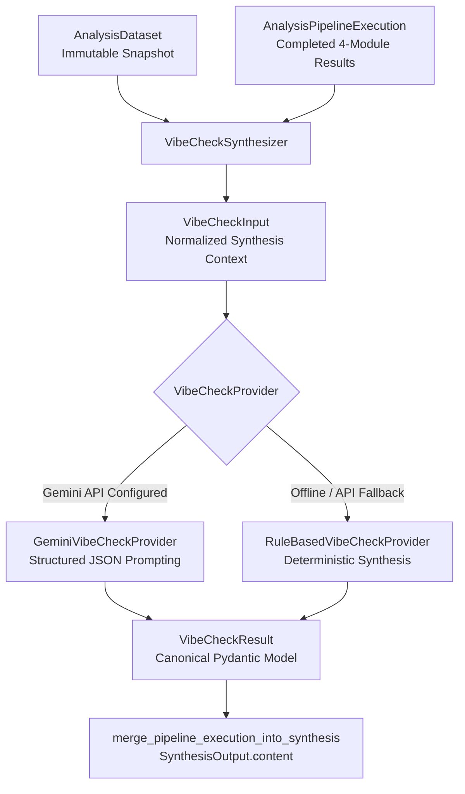

# Vibe Check Qualitative Synthesis Framework Architecture

## Purpose & Overview

The **Vibe Check Framework** serves as the qualitative generative AI synthesis layer in Project Luvcraft. While the 4 quantitative analytical modules (`sentiment`, `keywords`, `trend`, and `engagement`) compute versioned numeric scores, term frequencies, momentum directions, and interaction metrics, the Vibe Check Framework synthesizes these outputs together with raw signal text into human-readable narrative insights.

It produces:
- **Headline**: High-level executive summary title.
- **Overall Vibe**: Qualitative fandom/community posture label (e.g. *"Cautiously Optimistic (Lore Expansion Hype)"*).
- **Sentiment Narrative**: Explanatory narrative paragraph contextualizing sentiment scores and distributions.
- **Narrative Themes**: Core community topics with evidence counts and sentiment orientation.
- **Audience Posture**: Community breakdown (who is talking, toxicity level, consensus rating, and key requested demands).
- **Strategic Takeaways**: Actionable recommendation bullet points for researchers and brand strategists.

## Component Architecture

## Contracts & Schemas

### Input Contract: `VibeCheckInput`
Immutable input context constructed by `VibeCheckSynthesizer`:
- `run_id`: UUID
- `keyword`: Target search keyword.
- `timeframe_start` & `timeframe_end`: Analysis window.
- `sample_text_snippets`: Up to 15 representative signal text quotes.
- Quantitative Module Metrics:
  - `sentiment_score`, `sentiment_label`, `positive_count`, `neutral_count`, `negative_count`
  - `top_keywords`: Tuple of top extracted keywords.
  - `trend_score`, `trend_momentum` (`rising`, `stable`, `fading`)
  - `total_engagement_signals`, `total_views`, `total_likes`, `total_comments`

### Output Contract: `VibeCheckResult`
Canonical structured qualitative output:
- `headline`: High-level summary title string.
- `overall_vibe`: Qualitative vibe posture string.
- `confidence_score`: Float rating between 0.0 and 1.0.
- `sentiment_narrative`: Qualitative summary text.
- `narrative_themes`: Tuple of `VibeCheckNarrativeTheme` objects.
- `audience_posture`: `VibeCheckAudiencePosture` object.
- `strategic_takeaways`: Tuple of strategic recommendation strings.
- `provider_name` & `model_version`: Provenance tracking metadata.

## Provider Architecture

The framework utilizes a pluggable provider abstraction (`VibeCheckProvider` protocol):

1. **`GeminiVibeCheckProvider`**:
   - Uses Google Gemini API (`gemini-3.1-flash-lite`) with structured JSON output schemas (`response_schema=VibeCheckResult`).
   - System prompt instructions (`VIBE_CHECK_GEMINI_SYSTEM_PROMPT`) enforce untrusted text handling and JSON schema compliance.
   - Automatically catches network errors, schema validation issues, or missing API keys and falls back to `RuleBasedVibeCheckProvider`.

2. **`RuleBasedVibeCheckProvider`**:
   - High-performance, deterministic fallback provider.
   - Derives qualitative posture and themes directly from quantitative sentiment scores, keyword frequencies, and trend momentum without external API network calls.

## Production Integration & Backward Compatibility

`VibeCheckSynthesizer` integrates into `merge_pipeline_execution_into_synthesis` in `backend/app/analysis/production.py`:
- `content["vibe_check"]`: Stores the primary qualitative posture label for legacy API and frontend widget compatibility.
- `content["vibe_headline"]`: Stores the executive headline string.
- `content["vibe_sentiment_narrative"]`: Stores the qualitative sentiment narrative paragraph.
- `content["vibe_check_details"]`: Stores the complete `VibeCheckResult` JSON dict.

## Vibe Score (Task 8.2)

`VibeScoreCalculator` (`backend/app/analysis/vibe_check/scoring.py`) produces a single deterministic 0–100 **Vibe Score** per pipeline execution, methodology `vibe-score-v1`.

### Weighting strategy

| Component | Source | Normalization | Default weight |
|---|---|---|---|
| `sentiment` | `SentimentAnalysisData.average_score` | native 0–100 | 0.5 |
| `trend` | `TrendAnalysisData.trend_score` | native 0–100 | 0.3 |
| `engagement` | interactions per signal (views+likes+comments) | `min(100, 25 · log10(1 + x))` — documented heuristic | 0.2 |

Weights are configurable via `VibeScoreWeights` and must sum to 1.0.

### Missing-data policy

Absent or failed module results are **excluded** and remaining weights are renormalized — no fabricated `50` defaults. If no component is available the result is an explicit `insufficient_data` status with a null score. Identical inputs always produce identical scores.

### Labels

`>=80 very_positive`, `>=60 positive`, `>=40 neutral`, `>=20 negative`, else `very_negative`.

### Synthesis projection

`merge_pipeline_execution_into_synthesis` projects `vibe_score`, `vibe_score_label`, and the full `vibe_score_details` dict into `SynthesisOutput.content` for dashboard consumption.
